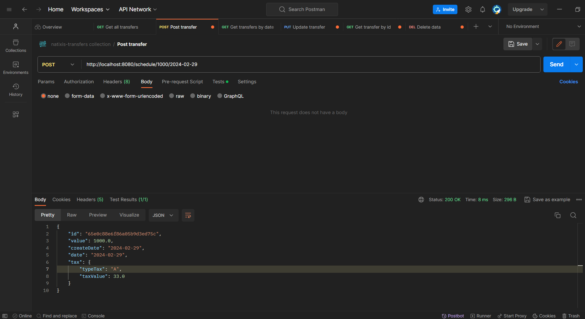
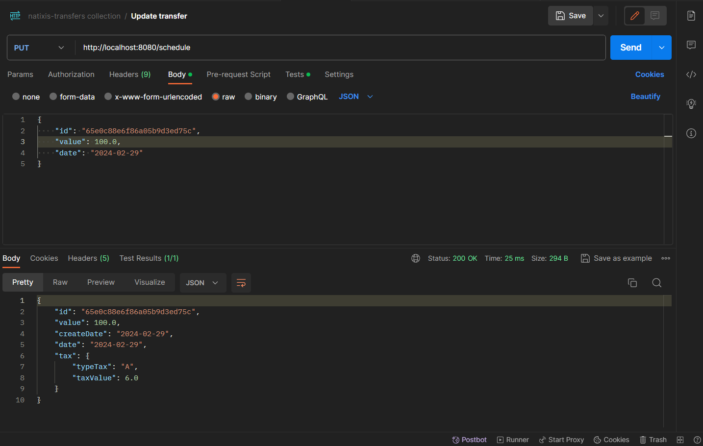
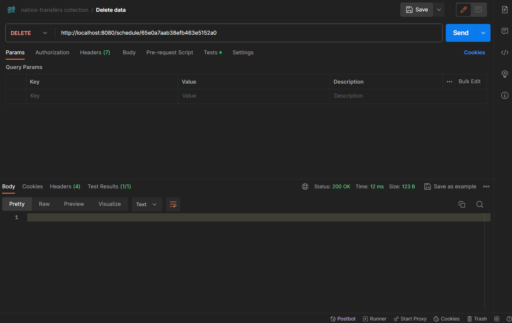
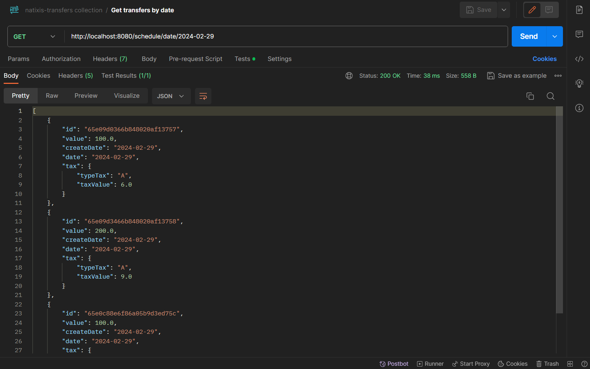
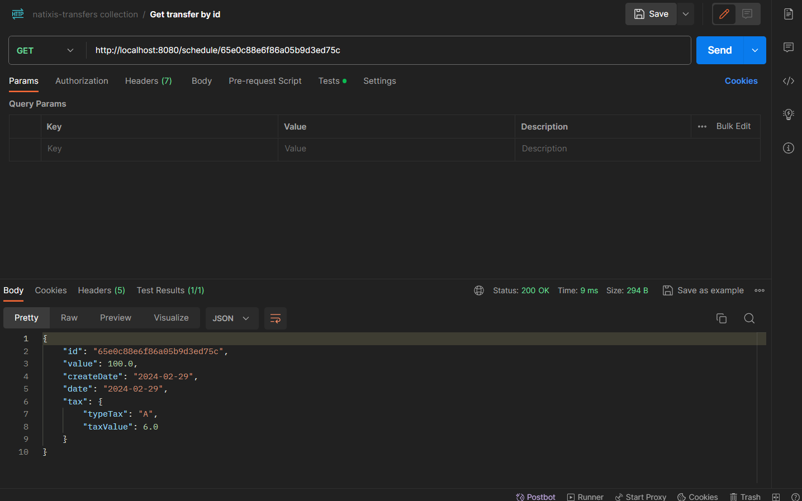
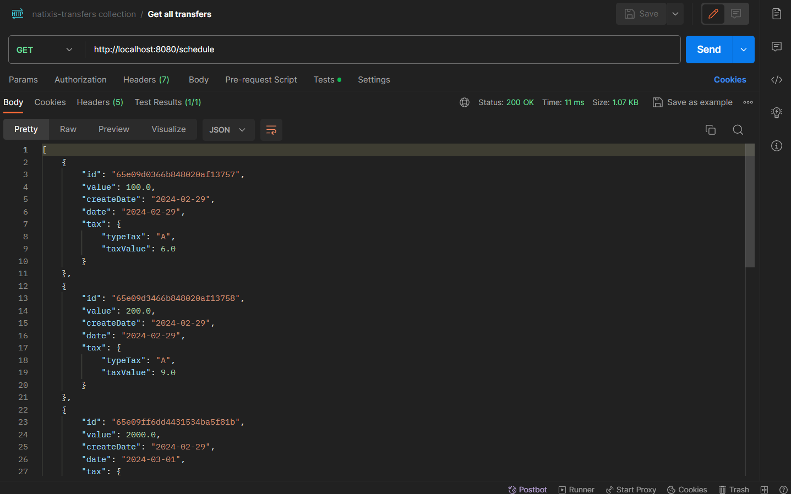
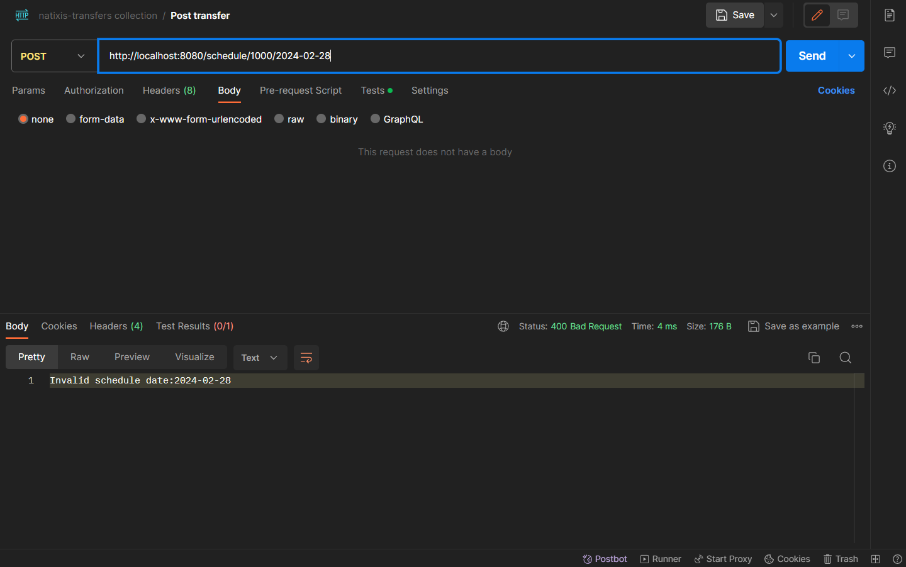
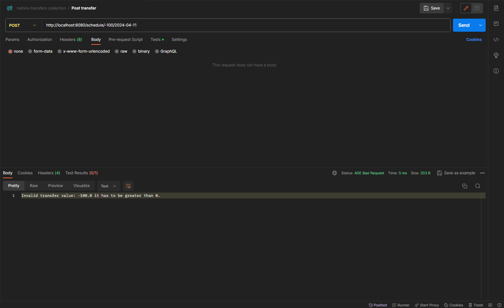
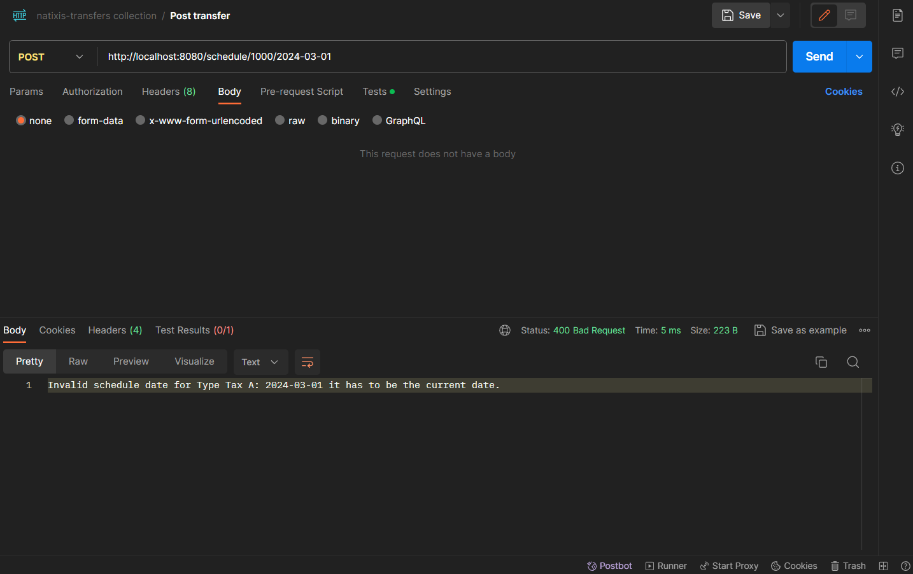
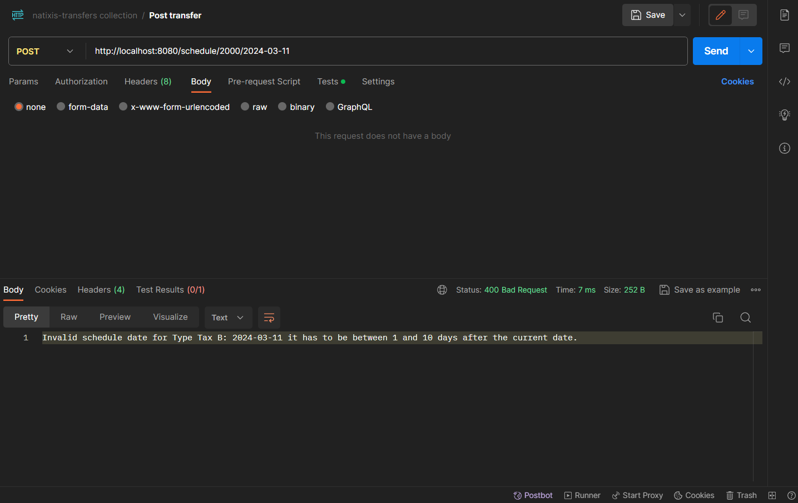

# Transfers API

This project is a bank transfer service. It allows users to schedule transfers, update existing transfers, retrieve all transfers, retrieve transfers by ID or date, and delete transfers.

## How to test the application

1. Clone the repository to your local machine using `git clone`.

2. Navigate to the project directory using `cd transfers`.

3. Run `mvn clean install` to build the project and run the unit tests.

    3.1. If you don't have Maven installed, you can download it from the official website: [Maven](https://maven.apache.org/download.cgi).
    
    3.2. After downloading, extract the zip file to the directory where you want to install Maven. For example, you could extract the file to C:\Program Files\Apache\Maven.  
    
    3.3. Next, you need to set up the environment variables. Open Control Panel -> System and Security -> System -> Advanced system settings. Click on "Environment Variables".  

    3.4. Create a new environment variable named M2_HOME and set its value to the directory where you installed Maven (for example, C:\Program Files\Apache\Maven).  
      Add the Maven bin directory to the system Path. Find the Path environment variable under "System variables" and click on "Edit". Add the following to the end of the value: ;%M2_HOME%\bin. 

    3.5. To verify that Maven has been installed correctly, open a new command prompt and run mvn -v. You should see the Maven version you

4. If the tests pass, you will see a message saying "BUILD SUCCESS".

5. To run the application, use the command `mvn spring-boot:run`.

6. The application will be available at `http://localhost:8080`.

## Endpoints

- `POST /schedule/{value}/{date}`: Schedules a new transfer with the provided value and date.
- `PUT /schedule`: Updates an existing transfer with the details provided in the request body.
    - Request body example:
    ```json
    {
        "id": "65e09d3466b848020af13758",
        "value": 4500.0,
        "date": "2024-04-29"
    }
    ```

- `GET /schedule/{id}`: Retrieves the details of a transfer by ID.
- `GET /schedule/date/{date}`: Retrieves all transfers scheduled for the provided date.
- `GET /schedule`: Retrieves all scheduled transfers.
- `DELETE /schedule/{id}`: Deletes the transfer with the provided ID.

## Postman Collection

I have provided a Postman collection to make it easier to test the endpoints. You can import this collection into Postman and use it to send requests to the application.

1. Download the Postman collection from the `postman` directory in the project repository.

2. Open Postman and click on the `Import` button.

3. Select the downloaded file to import the collection.

4. Once the collection is imported, you can select an endpoint and click the `Send` button to send a request.

Please make sure the application is running before sending requests through Postman.

## Tests

The unit tests are located in the `src/test/java/com/natixis/transfers` directory. They test the individual services and controllers.

To run the tests, use the command `mvn test`.

## Technologies Used

- Java
- Spring Boot
- Maven
- JUnit
- Mockito
- MongoDB
- Postman
- Git
- GitHub
- IntelliJ IDEA

## Api Proofs

### Create a new transfer



### Update an existing transfer



### Delete a transfer



### Get a transfer by date



### Get a transfer by ID



### Get all transfers



### Error handling

#### Create a transfer with a date before the current date



#### Create a transfer with a negative value



#### Create a tranfer for Type Tax A but with a date after the current date



#### Create a transfer for Type Tax B but with a date that is not between 1 and 10 days away from the current date.




## Author

This project was created by **Pedro Pacheco** and if you want to see my jobs and education, I have a personal portfolio website made with 
Javascript and React. You can see in this link [Website Portfolio](https://pedrorfpacheco.github.io/portfolio/).